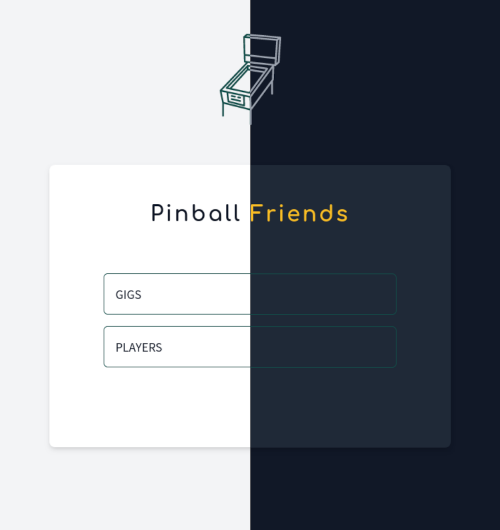

# Pinball Friends



A minimalistic app to store pinball scores between friends.

No user authentication, just an easy-to-use app. See [security](#Security) if you want HTTP Basic protection.

A live demo is available [here](https://demo.pinball-friends.com/).

## Requirements

- PHP (>= 8.1), composer, node >= 18.0.
- Tested with SQLite, but should work with MySQL and Postgres too.

## Installation

```shell
cp .env.example .env
```

Change `DB_DATABASE` to specify an absolute path where your sqlite database will be stored.

```shell
make local-install
```

Run it locally:

```shell
npm run dev
php artisan serve
```

## Deployment

The app can be easily deployed on many hosting services since it uses Laravel (PHP) and SQlite.

If you want to host it on [Fly](https://fly.io), which offers a generous free tier, follow these instructions (an adapted [Dockerfile](Dockerfile) is already present in this repository):

- [Install flyctl](https://fly.io/docs/hands-on/install-flyctl/) and [log in](https://fly.io/docs/hands-on/sign-in/).
- Change the `app` variable in [fly.toml](fly.toml) and choose a unique name.
- `flyctl apps create <APP_NAME>`
- `flyctl volume create my_database_volume -n 1 -r <REGION>>` (see available regions on fly [here](https://fly.io/docs/reference/regions/)). Use only one volume if you're using SQLite.
- Add metedata on the volume if needed
- `flyctl deploy`

## Security

To avoid giving access anyone to your app (and potentially editing your data), set these two env vars:

```
SECURITY_USERNAME="foo"
SECURITY_PASSWORD="bar"
```

Then your app will prompt a basic HTTP access.
